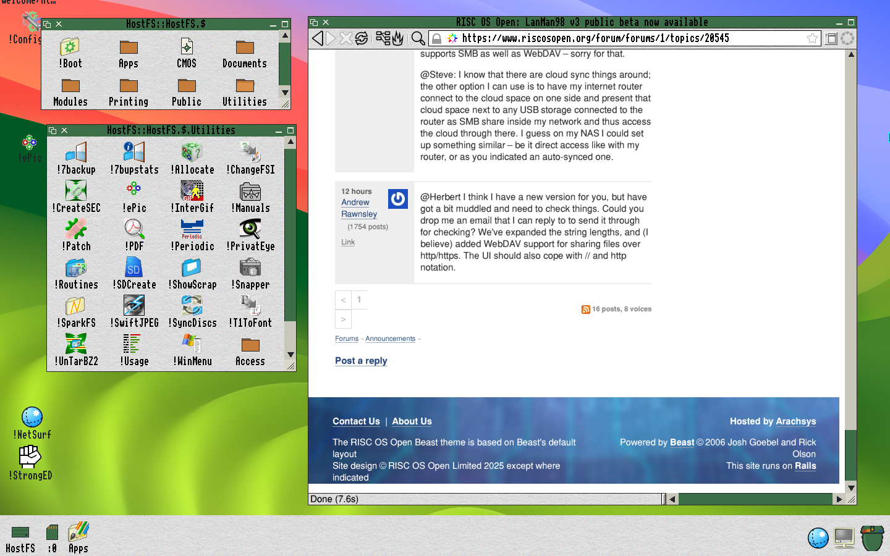

# Aldershot

**RISC OS, on the computer you already own.**

**Coming soon: BOX — RISC OS translated to C over a Linux kernel.**
A first preview is here now: **[Preview: early days BOX, x64](#preview-early-days-box-x64)**,
booting from a USB stick on a 64-bit PC.

> ⚠️ **This is brand-new software.** It's early days: it works and it's
> usable today, but you may meet the odd rough edge. If something doesn't
> behave, please let us know.

This is the front door. It is where you find out what exists, whether it
works yet, and where to get it. There is no source code in this
repository — just these pages, the user guide, the developer
walkthroughs and case notes, and the downloads on the
[Releases](https://github.com/albanread/Aldershot/releases) page.

---

## What's here

| | | |
| --- | --- | --- |
| 🍎 | **[RISC OS for the Mac](#risc-os-for-the-mac)** | Works on **macOS 26**. Download for [Apple silicon](https://github.com/albanread/Aldershot/releases/download/RISCOSQEA72v1/RISCOSQEA72v1.dmg) or [Intel](https://github.com/albanread/Aldershot/releases/download/RISCOSQEA72v1/RISCOSQEA72v1-x86_64.dmg) · [User guide](mac/user-guide.md) |
| 🪟 | **[RISC OS for Windows](#risc-os-for-windows)** | Works on **64-bit Windows 10 or 11**. [Download the setup program](https://github.com/albanread/Aldershot/releases/download/RISCOSQEA72v7-windows/RISCOSQEA72v7-setup.exe) · [Release notes](https://github.com/albanread/Aldershot/releases/tag/RISCOSQEA72v7-windows) |
| 🧪 | **[Preview: early days BOX, x64](#preview-early-days-box-x64)** | Boots RISC OS from a **USB stick on a 64-bit PC**. Under the QEMU releases, for the adventurous. |

More will be added as they become worth your time. Something is listed
here when it actually runs, not when it is started.

Curious how it works? The [developer walkthroughs](walkthroughs/README.md)
tell the whole story, from the first boot in QEMU to the files on your disc.

---

## What it looks like

The final screenshot: a desktop you can use. The machine is booted off
**HostFS** — its disc is a folder on the Mac — and running **HostNet**,
so its networking is the Mac's networking. The background behind the
RISC OS desktop is composited by the host, showing through the pixels
RISC OS marks as background, and the desktop's sprite plots are
executed by the host too. No emulated disc drive, network card or GPU
is doing any of the work: the machine asks, and the Mac answers.

---

## RISC OS for the Mac

RISC OS 5.30, running on your Mac in its own window. The desktop, the
icon bar, the Filer, NetSurf — the real thing, not a picture of it.

It works by pretending to be a Raspberry Pi, which is the machine RISC OS
is built for these days. You do not have to know or care about that; you
open the app and RISC OS starts up.

> **Download RISCOSQEA72v1** for macOS 26: **[Apple silicon](https://github.com/albanread/Aldershot/releases/download/RISCOSQEA72v1/RISCOSQEA72v1.dmg)** · **[Intel](https://github.com/albanread/Aldershot/releases/download/RISCOSQEA72v1/RISCOSQEA72v1-x86_64.dmg)** · [User guide](mac/user-guide.md)

### What you can do with it

- **Use the desktop** — windows, menus, the icon bar, the lot
- **Browse the web** with NetSurf, over your Mac's internet connection
- **Share files with your Mac** — the RISC OS disc is a folder on your
  Mac, one you choose the first time. Drop a file in there on the Mac
  and it's inside RISC OS; save something in RISC OS and it's there on
  the Mac.
- **Hear it** — sound comes out of your Mac's speakers
- **Type and click** normally
- **Fill your screen** — see below

On an Apple silicon Mac it takes about **twenty seconds** from starting
the app to a desktop you can use.

### Screen sizes

RISC OS offers a range of screen sizes; you pick one from its own Display
Manager while it is running:

640×480 · 800×600 · 1024×768 · 1280×720 · 1280×800 · 1280×1024 ·
1440×900 · 1600×1200 · 1920×1080 · **1920×1200**

The last two are the useful ones on a Mac. **1920×1200** is 16:10, the
shape of a MacBook screen, so a RISC OS desktop fills it rather than
sitting in a letterbox; on a Retina display it maps one RISC OS pixel to
one screen pixel, which looks crisp.

You can also start up in a particular size rather than picking one each
time. The window opens to match whatever RISC OS is running, and you can
resize it freely afterwards — the picture scales to fit, so a big desktop
in a small window still works.

### The three mouse buttons

RISC OS expects a three-button mouse, and Macs have not shipped one for a
very long time. So:

| To press | Do this |
| --- | --- |
| **Select** (the normal one) | Click |
| **Menu** (opens menus — you'll want this a lot) | **Control**-click |
| **Adjust** | **Command**-click |

Option-click and Shift-click also give you Adjust, if either is comfier.

### What you'll need

**A Mac running macOS 26** or later. That is the one real requirement:
if your Mac runs macOS 26, it runs RISC OS — Apple silicon or Intel.
There are two downloads, one for each kind of processor:

| Your Mac | Download |
| --- | --- |
| **Apple silicon** (M1 or newer) | [RISCOSQEA72v1.dmg](https://github.com/albanread/Aldershot/releases/download/RISCOSQEA72v1/RISCOSQEA72v1.dmg) |
| **Intel** | [RISCOSQEA72v1-x86_64.dmg](https://github.com/albanread/Aldershot/releases/download/RISCOSQEA72v1/RISCOSQEA72v1-x86_64.dmg) |

Not sure which you have? **Apple menu › About This Mac** shows the chip
and the macOS version.

That's it. RISC OS itself is in the download:

- **The ROM** — RISC OS 5.30 from [RISC OS Open](https://www.riscosopen.org),
  the people who make RISC OS. It is their Raspberry Pi release, published
  under the Apache 2.0 licence, with our HostFS filing system added so
  that RISC OS can see the disc below.
- **A minimal guest file system** — the disc RISC OS boots from: a
  cut-down version of RISC OS Open's own disc, with the desktop and its
  Configure tools, NetSurf, StrongED, PipeDream, Ovation Pro and a shelf
  of utilities. No developer tools, no app store, no manuals, no games —
  enough to use, small enough to download.

Both downloads carry the same RISC OS and the same disc. There is
nothing to fetch from anywhere else and nothing to set up.

### Installing it

Download the disk image for your Mac, open it and drag **RISCOSQEA72v1**
to Applications, then open it. It is signed and notarised, so macOS only
asks, the first time, whether you're sure about an app you downloaded.

On its first run the app asks where to keep the RISC OS disc: a folder
called **RISCOS** in your home folder, or one you choose. That folder is
your disc from then on; a later version of the app never replaces it,
and holding down **Option** as the app starts lets you choose again.

The [user guide](mac/user-guide.md) covers the rest: the mouse and
keyboard, screen sizes, how files cross between the Mac and RISC OS, and
what to do when something goes wrong.

### Good to know

**This is a first release** — RISCOSQEA72v1. It's early software: it
works and it's usable, with a few edges still to smooth. A few honest
notes:

- It needs macOS 26. A Mac on an older version of macOS won't open it,
  for now.
- The volume control inside RISC OS doesn't do anything — use your Mac's.
- The first few seconds of startup are slower than they will be.
- On a high-resolution screen the window opens small — one RISC OS pixel
  to one screen pixel. Drag it bigger; the picture scales.

It's a young project and an active one. If that sounds fine to you,
you'll get on with it well.

---

## RISC OS for Windows

RISC OS 5.30, running on your PC in its own window. The desktop, the
icon bar, the Filer, NetSurf — the real thing, not a picture of it.

It works the same way the Mac one does: by pretending to be a
Raspberry Pi, which is the machine RISC OS is built for these days.
You do not have to know or care about that; you start it up and RISC
OS boots.

> **Download RISCOSQEA72v7** for 64-bit Windows: **[RISCOSQEA72v7-setup.exe](https://github.com/albanread/Aldershot/releases/download/RISCOSQEA72v7-windows/RISCOSQEA72v7-setup.exe)** · [Release notes](https://github.com/albanread/Aldershot/releases/tag/RISCOSQEA72v7-windows)

### What you can do with it

- **Use the desktop** — windows, menus, the icon bar, the lot
- **Browse the web** with NetSurf, over your PC's internet connection —
  through HostNet, below
- **Share files with your PC** — the RISC OS disc is a folder on your PC,
  **RISCOSQEA72** in your user folder. Drop a file in there on Windows
  and it's inside RISC OS; save something in RISC OS and it's there on
  Windows.
- **Hear it** — sound comes out of your PC's speakers
- **Take screenshots** with the Print Screen key
- **Type and click** normally
- **Fill your screen** — see below

On the PC it was tested on it takes about **fifteen seconds** from
starting it to a desktop you can use.

### Screen sizes

RISC OS offers a range of screen sizes; you pick one from its own Display
Manager while it's running:

640×480 · 800×600 · 1024×768 · 1280×720 · 1280×800 · 1280×1024 ·
1440×900 · 1600×1200 · 1920×1080 · **1920×1200**

You can also start up in a particular size rather than picking one each
time. The window opens to match whatever RISC OS is running, and you can
resize it freely afterwards — the picture scales to fit, so a big
desktop in a small window still works and stays readable.

### The three mouse buttons

RISC OS expects a three-button mouse. If you have a three-button mouse,
it just works. If you don't:

| To press | Do this |
| --- | --- |
| **Select** (the normal one) | Left-click |
| **Menu** (opens menus — you'll want this a lot) | **Middle**-click, or **Shift**+F10 |
| **Adjust** | **Right**-click |

While you're in a menu, the pointer stays where RISC OS put it. If the
pointer ever gets out of step with your mouse, middle-click or press
**Ctrl+Alt+G** to grab it; same keys to let go.

### HostNet: the network, handed to Windows

The new Windows setup includes **HostNet**. RISC OS normally does all of
its own networking, right down to driving an emulated USB network card.
HostNet redirects it to Windows instead: when a program such as NetSurf
opens a connection, the request goes straight to Windows, and Windows
makes it. It should be faster and more reliable than the emulated USB
network.

It is **not a complete network stack**. It redirects IP sockets — the TCP
and UDP connections that internet programs make — and nothing beneath
them. So it is for TCP/IP applications: web browsing, name lookups,
fetching files, and programs that listen for connections. Anything that
works below the sockets has nothing to talk to: `Ping`, `IfConfig`, `ARP`,
`route` and `InetStat` have nothing to report, ShareFS, Access and Econet
don't work over it, and it is IPv4 only.

HostNet is **on** when you first install. To switch it off or on, click
the **icon at the top left of the window** and choose **HostNet** from
that menu — a tick means on. The change takes effect the next time RISC
OS starts: restart RISC OS, or close the window and start it again. With
HostNet off, RISC OS goes back to its own network stack and the emulated
USB network card.

### What you'll need

**A PC running Windows 10 or 11**, 64-bit.

That's it. RISC OS itself is in the download, as it is for the Mac: the
same RISC OS 5.30 ROM from [RISC OS Open](https://www.riscosopen.org)
with our HostFS filing system added, and the same minimal guest file
system, with HostNet on it.

### Installing it

Download **RISCOSQEA72v7-setup.exe** and run it. It installs for you
alone and asks for no administrator rights, and puts **RISC OS on QEMU
(A72)** on your desktop and in the Start menu.

The setup program isn't code-signed yet, so Windows may say it protected
your PC. Choose **More info**, then **Run anyway**.

The disc is the **RISCOSQEA72** folder in your user folder. Installing a
later version never replaces your files there, and uninstalling leaves
it alone.

### One thing to know before you use it

**Close the window to switch off.** The window's close button shuts
RISC OS down properly, like switching off a real machine. Please don't
end it from Task Manager — that's yanking the plug out mid-write, and
discs (real or emulated) don't like it.

### Good to know

**This is the first Windows release** — RISCOSQEA72v7. It works and it's
usable, with a few edges still to smooth. A few honest notes:

- The setup program isn't code-signed yet, hence the warning when you
  run it.
- Keep the window open while RISC OS is busy: minimised, it runs a great
  deal slower.
- With HostNet switched off, the emulated network card sometimes fails
  to look names up, and NetSurf says *"Couldn't resolve host name"*.
  HostNet doesn't have that problem.
- You can't drag files from Windows into RISC OS by dropping them on
  the window — put them in the disc folder instead.

It's a young project, same as the Mac one. It works, and it's usable,
but it hasn't had the polish a finished thing deserves.

---

## Preview: early days BOX, x64

A first look at **BOX** — RISC OS, but not pretending to be a Raspberry
Pi. This is a preview release: early days, for people who like being
close to the machinery.

*This is high atmospheric testing compared to the moonshot, but we aim
for low earth orbit.*

It boots RISC OS from a **USB stick on a 64-bit PC**. No emulator, no
pretending to be a Raspberry Pi: a small Linux kernel provides the
hardware's kernel services, and a **RISC OS personality** then runs
**native x64 code** on your machine.

### One thing to know: memory

Native x64 code uses a lot more memory than the 32-bit RISC OS you may
be used to — compiled code, its runtime, everything, is twice the size
per pointer and happier with bigger buffers. The desktop still starts
with the slots you know, but **adjust your WimpSlots accordingly**: give
tasks more than their classic values, and expect the next slot's default
to be larger. An application that ran happily in 640K of emulation wants
more here.

### Where it fits

This is the same RISC OS you see in the Mac and Windows releases — same
desktop, same applications, same discs — but running on the metal of
your PC, with Linux underneath doing what a kernel does: memory, tasks,
and the devices. It is where this project is going, offered early
because the adventurous make the best testers.

---

## Downloads

- **Mac, macOS 26:** RISCOSQEA72v1 for [Apple silicon](https://github.com/albanread/Aldershot/releases/download/RISCOSQEA72v1/RISCOSQEA72v1.dmg) or for
  [Intel](https://github.com/albanread/Aldershot/releases/download/RISCOSQEA72v1/RISCOSQEA72v1-x86_64.dmg), a disk image. Open it and drag the app to Applications.
  The [release page](https://github.com/albanread/Aldershot/releases/tag/RISCOSQEA72v1) has the checksums, and the
  [user guide](mac/user-guide.md) the rest.
- **Windows, 64-bit Windows 10 or 11:** RISCOSQEA72v7, a
  [setup program](https://github.com/albanread/Aldershot/releases/download/RISCOSQEA72v7-windows/RISCOSQEA72v7-setup.exe). Run it; it installs for you alone.
  The [release page](https://github.com/albanread/Aldershot/releases/tag/RISCOSQEA72v7-windows) has the release notes.

Every release is on this repository's
[Releases](https://github.com/albanread/Aldershot/releases) page.

---

## For developers

The [developer walkthroughs](walkthroughs/README.md) explain how all of
this was built, for anyone who wants to understand it or work on it:

- [RISC OS on a Pi 4, in QEMU](walkthroughs/QemuA72Walkthrough/index.md) — start here
- [Fake it in software](walkthroughs/FakeItInSoftwareWalkthrough/index.md)
- [Graphics and sound, done by the host](walkthroughs/GraphicsSoundWalkthrough/index.md)
- [The backdrop layer: a background the host draws beneath RISC OS](walkthroughs/BackdropWalkthrough/index.md)
- [HostFS: a host directory as a RISC OS disc](walkthroughs/HostFSWalkthrough/index.md)
- [HostNet: the guest's sockets, served by the host](walkthroughs/HostNetWalkthrough/index.md)
- [Mojo for RISC OS](walkthroughs/MojoRISCOSWalkthrough/index.md)

Each one is also a single PDF.

The [case notes](case-notes/README.md) file problems met while running
real software on the emulator, with the evidence and what is still open.
The first is
[WimpForth: an fsave that aborts the machine](case-notes/2026-09-15-wimpforth-fsave-abort/index.md).

---

## The small print

The software is free and open source, under the
[GNU General Public License, version 2](LICENSE) — the same licence QEMU
uses, which the Mac and Windows applications are built from.

Each project also keeps its own code in its own place. For the Mac and
Windows ones that's [RISCOSQEMUA72](https://github.com/albanread/RISCOSQEMUA72).
The [walkthroughs](walkthroughs/README.md) are a long and fairly candid
account of how they were built, if you're curious about that sort of thing.

**RISC OS is included in the Mac and Windows downloads**: RISC OS 5.30
as published by RISC OS Open Ltd under the Apache 2.0 licence, with our
HostFS module added, plus a minimal guest file system drawn from their
disc image. The applications on that disc belong to their authors and
keep their own licences.

## Standing on

The Mac and Windows applications are built on **[QEMU](https://www.qemu.org)**, the
machine emulator that does the hard part — pretending to be a Raspberry
Pi convincingly enough that RISC OS never notices. Our thanks to everyone
who built it.

**[RISC OS Open Ltd](https://www.riscosopen.org)** make RISC OS 5 and
publish it as open source. The ROM and the disc contents in the Mac and
Windows downloads are theirs.

**The source for what we release is here:**

- **[albanread/RISCOSQEMUA72](https://github.com/albanread/RISCOSQEMUA72)**
  — our fork, branch `riscos-pi4`. This is the one. Everything that makes
  RISC OS run, and the Mac and Windows applications themselves, live here.
- [gitlab.com/qemu-project/qemu](https://gitlab.com/qemu-project/qemu) —
  upstream QEMU, which the fork is based on.
