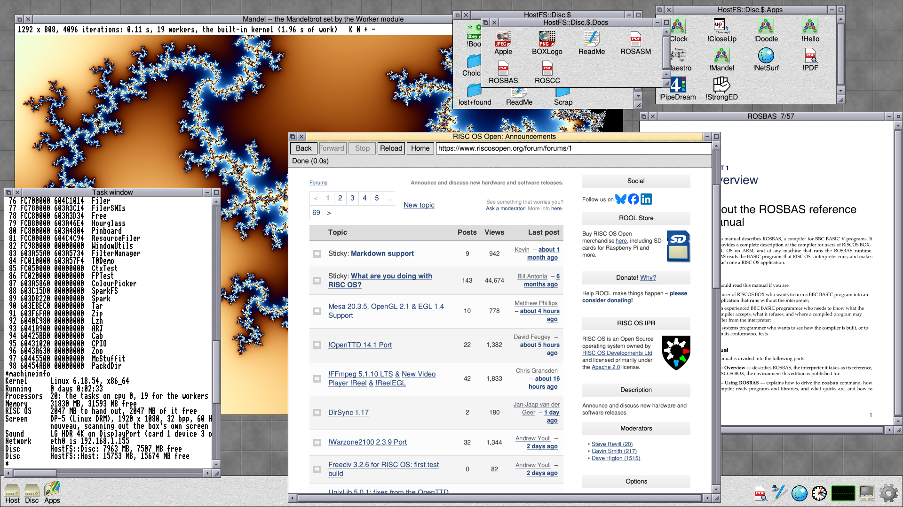

# BOX

RISC OS for generic devices: RISC OS translated to C, running on a Linux kernel, on a 64-bit PC or a Mac.

## Downloads

Early previews, from the [Releases page](https://github.com/albanread/Aldershot/releases):

- [BOX for Apple silicon Macs](https://github.com/albanread/Aldershot/releases/tag/BOX-arm64-mac-2026.10.08) (macOS 14 or later)
- [BOX for Intel Macs](https://github.com/albanread/Aldershot/releases/tag/BOX-x64-mac-2026.10.07) (macOS 14 or later)
- [BOX x64 for PCs](https://github.com/albanread/Aldershot/releases/tag/BOX-x64-pc-2026.10.07) (USB stick image, UEFI)

## Ports

The modules and applications in BOX are ported. Some need only small changes. Others are rewritten completely in C. The work is done a step at a time, and a port may bring in bugs that the original does not have.

Please do not report missing features or faults in BOX's software to the original authors. Their ARM code very likely works perfectly on a Raspberry Pi 4; the fault is in the port, not in their work.

There is no need to report them here either. The project finds faults itself, by testing BOX against RISC OS 5.30.

## Performance

RISC OS's own ARM code is extremely efficient on an ARM processor such as the Raspberry Pi 4's Cortex-A72. Porting that code to C costs a good deal of speed, and needs more memory. Translated C is also 1.5 to 3 times slower than C written by hand.

So BOX is not suited to Raspberry Pi class machines. It performs well on computers such as Apple silicon Macs, or PCs with an Intel Core i7-12700.

BBC BASIC suffers from the translation too, and does not run as much faster as the difference in processor power might suggest. To make up for this, BOX includes a translator from BBC BASIC to C, `*RosBas`.

## Documents

- [docs](docs/README.md): documents about BOX. [Bugs and quirks](docs/bugs-and-quirks.md) lists the bugs, quirks and documentation errors noticed in RISC OS 5.30 and its applications while porting them.

## Licences

Important licence update information has been added to the repository: see [LICENSES](LICENSES/README.md).

*Anyone with genuine concerns about software licences should raise an issue.*

*BOX does not claim ownership of any code that the project did not originally write. All of the code will be published when it is ready.*

- [LICENSES](LICENSES/README.md): the licence of every component. BOX's own code is under the MIT licence. RISC OS is RISC OS Open Ltd's, under the Apache License 2.0.
- [gpl](gpl/README.md): the source of the components under the GNU GPL, GNU LGPL, MPL 2.0 and CDDL.

Code that BOX has translated to C stays under the licence of the code it was translated from: RISC OS translated to C is still under the Apache License 2.0. BOX claims no ownership of translated code.

## Source code

It is the intention to publish all of the source code of this project. Each port will be published when it is feature complete and maintainable. Publishing incomplete, unreadable, automatically translated code would not be a useful contribution to the community. The work will take several months.

Until then, the source of every component whose licence asks for it is published in [gpl](gpl/README.md).

Published so far, in [src](src):

- [ROSASM](src/ROSASM/README.md), the ObjAsm-compatible assembler;
- [ROSBAS](src/ROSBAS/README.md), the BBC BASIC V compiler (the compiler only; its runtime library will follow).
